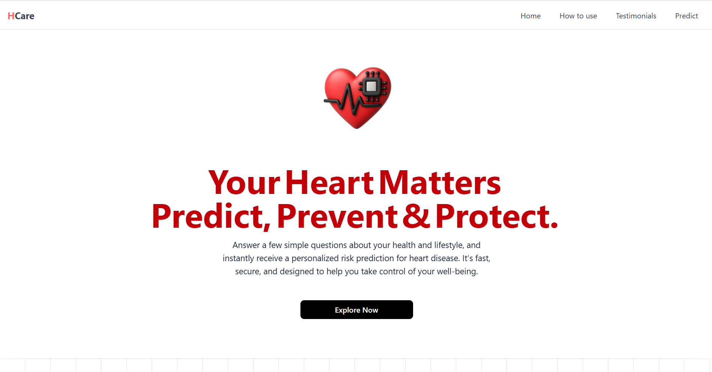
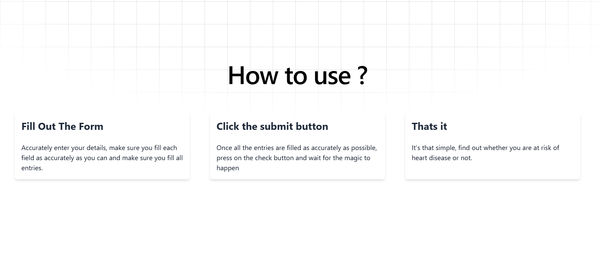
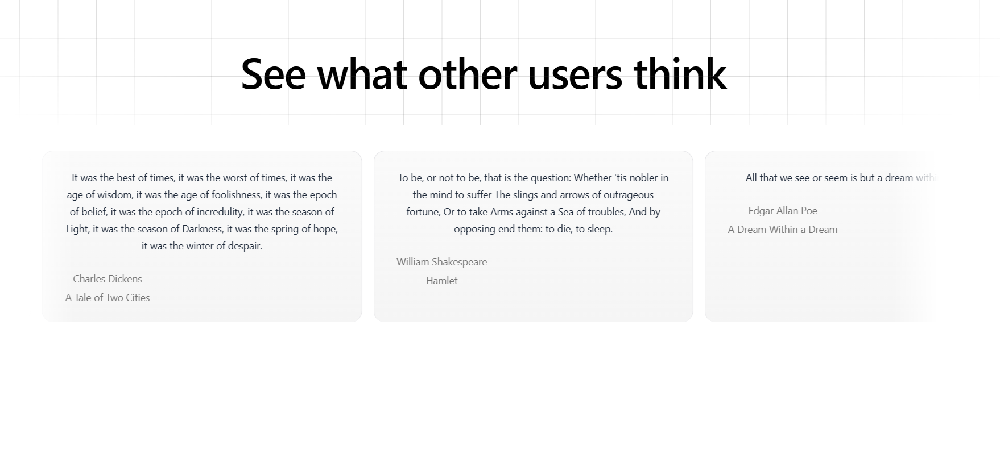
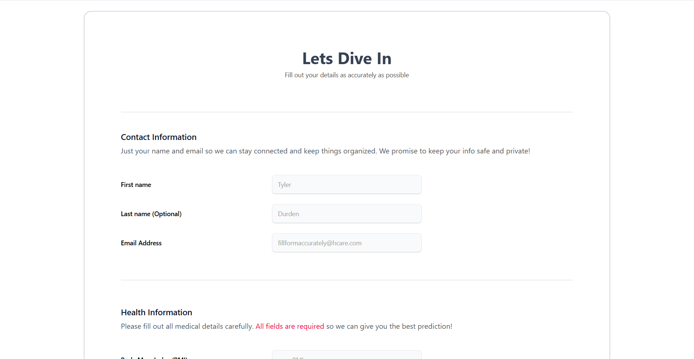
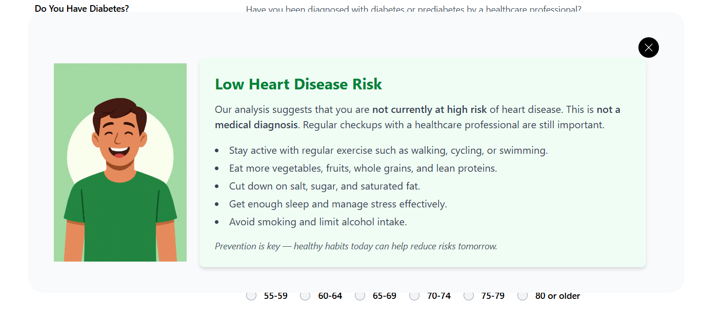

# HCare – Heart Disease Predictor 

HCare is a **machine learning–powered web application** that predicts the likelihood of heart disease based on user health data.  
It helps individuals assess their risk and provides lifestyle suggestions for better heart health.  

---

## ✨ Features
- Heart disease risk prediction using a trained ML model.
- Modular architecture: **Client + Server + ML Service**.
- REST API for predictions.
- One-page React frontend with a clean UI.
- Health tips based on prediction results.

---

## 🛠 Tech Stack
- **Frontend:** React, TailwindCSS  
- **Backend API:** Node.js, Express.js  
- **ML Service:** Python, scikit-learn  

---

## 🎥 Demo

### Hero

### User Guide

### Testimonials

### Form

### Result

